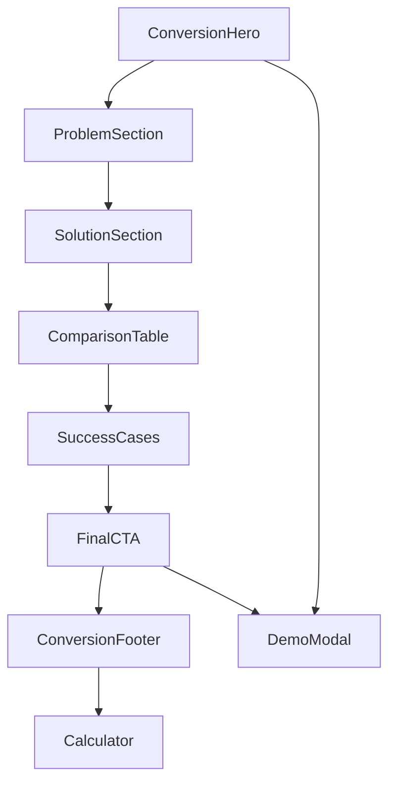

# Estructura del Proyecto - Magic-Lum Landing Page

Esta documentación detalla la organización completa del proyecto para facilitar el mantenimiento y desarrollo futuro.

## 📁 Estructura de Archivos

```
magic-lum-landing/
├── 📁 app/                          # App Router de Next.js 14
│   ├── 📁 calculadora/              # Página secundaria (herramienta técnica)
│   │   └── 📄 page.tsx              # Calculadora técnica GOBO
│   ├── 📄 layout.tsx                # Layout raíz con metadatos SEO
│   ├── 📄 page.tsx                  # Página principal (funnel de conversión)
│   └── 📄 globals.css               # Estilos globales con Tailwind
│
├── 📁 components/                   # Componentes reutilizables
│   ├── 📄 ConversionHero.tsx        # Hero section con CTA principal
│   ├── 📄 ProblemSection.tsx        # Agitación del problema (dolor)
│   ├── 📄 SolutionSection.tsx       # Presentación de la solución
│   ├── 📄 ComparisonTable.tsx       # Tabla comparativa (superioridad)
│   ├── 📄 SuccessCases.tsx          # Casos de éxito (prueba social)
│   ├── 📄 FinalCTA.tsx              # CTA final con oferta irresistible
│   ├── 📄 DemoModal.tsx             # Modal de formulario optimizado
│   ├── 📄 ConversionFooter.tsx      # Footer minimalista para conversión
│   └── 📄 Calculator.tsx            # Calculadora técnica (página /calculadora)
│
├── 📁 lib/                          # Lógica de negocio y utilidades
│   ├── 📄 calculator-data.ts        # Base de datos de proyectores y lentes
│   └── 📄 calculator-logic.ts       # Algoritmos de cálculo GOBO
│
├── 📁 public/                       # Assets estáticos
│   ├── 📄 favicon.ico               # Favicon del sitio
│   ├── 📄 robots.txt                # Generado automáticamente por next-sitemap
│   └── 📄 sitemap.xml               # Generado automáticamente por next-sitemap
│
├── 📁 docs/                         # Documentación del proyecto
│   ├── 📄 CONTRIBUTING.md           # Guía de contribución
│   ├── 📄 DEPLOYMENT.md             # Guía de despliegue en Vercel
│   └── 📄 PROJECT-STRUCTURE.md      # Este archivo
│
├── 📁 .next/                        # Build artifacts (generado automáticamente)
├── 📁 node_modules/                 # Dependencias de npm
│
├── 📄 .env.example                  # Plantilla de variables de entorno
├── 📄 .env.local                    # Variables de entorno locales (ignorado por git)
├── 📄 .eslintrc.json                # Configuración de ESLint
├── 📄 .gitignore                    # Archivos ignorados por Git
├── 📄 LICENSE                       # Licencia MIT
├── 📄 README.md                     # Documentación principal
├── 📄 next-sitemap.config.js        # Configuración del sitemap
├── 📄 next.config.js                # Configuración de Next.js
├── 📄 package.json                  # Dependencias y scripts del proyecto
├── 📄 postcss.config.js             # Configuración de PostCSS
├── 📄 tailwind.config.js            # Configuración de Tailwind CSS
├── 📄 tsconfig.json                 # Configuración de TypeScript
└── 📄 vercel.json                   # Configuración de despliegue en Vercel
```

## 🎯 Arquitectura del Funnel de Conversión

### Flujo de Componentes



### Jerarquía de Información

```
1. 🎯 ConversionHero (Above the fold)
   ├── Headline de impacto
   ├── Subtítulo con beneficios
   ├── CTA principal
   └── Prueba social inmediata

2. ⚡ ProblemSection (Agitación)
   ├── Estadísticas impactantes
   ├── Costos económicos
   └── Dolor emocional

3. 💡 SolutionSection (Solución)
   ├── Contraste claro
   ├── Demo visual
   └── Beneficios específicos

4. 📊 ComparisonTable (Lógica)
   ├── Tabla comparativa
   ├── Métricas objetivas
   └── Diferenciación clara

5. 🏆 SuccessCases (Prueba Social)
   ├── Casos específicos
   ├── Resultados cuantificables
   └── Testimonial destacado

6. 🚀 FinalCTA (Conversión)
   ├── Oferta irresistible
   ├── Eliminación de objeciones
   └── Urgencia controlada
```

## 🔧 Tecnologías y Dependencias

### Stack Principal

| Tecnología | Versión | Propósito |
|------------|---------|-----------|
| **Next.js** | 14.0.4 | Framework React con SSR/SSG |
| **React** | 18.2.0 | Biblioteca de UI |
| **TypeScript** | 5.3.3 | Tipado estático |
| **Tailwind CSS** | 3.3.6 | Framework de CSS utilitario |
| **Framer Motion** | 10.16.16 | Animaciones fluidas |

### Dependencias de Desarrollo

| Paquete | Propósito |
|---------|-----------|
| **ESLint** | Linting de código |
| **PostCSS** | Procesamiento de CSS |
| **Autoprefixer** | Prefijos CSS automáticos |
| **next-sitemap** | Generación de sitemap |

### Dependencias de UI

| Paquete | Propósito |
|---------|-----------|
| **lucide-react** | Iconos SVG optimizados |
| **clsx** | Utilidad para clases condicionales |
| **tailwind-merge** | Merge inteligente de clases Tailwind |

## 🎨 Sistema de Diseño

### Colores Principales

```css
:root {
  --magic-gold: #FFD800;      /* Dorado principal - CTAs y acentos */
  --magic-dark: #0A0A0A;      /* Negro profundo - fondos */
  --conversion-green: #10B981; /* Verde - elementos positivos */
  --danger-red: #EF4444;      /* Rojo - problemas y urgencia */
}
```

### Tipografía

```css
/* Fuente principal */
font-family: 'Inter Tight', sans-serif;

/* Jerarquía de tamaños */
.text-hero: 4rem - 7rem;     /* Títulos principales */
.text-section: 2.5rem - 4rem; /* Títulos de sección */
.text-card: 1.25rem - 1.5rem; /* Títulos de tarjetas */
.text-body: 1rem - 1.25rem;   /* Texto de cuerpo */
```

### Espaciado y Layout

```css
/* Container principal */
max-width: 1200px;
padding: 0 1rem; /* Mobile */
padding: 0 2rem; /* Desktop */

/* Secciones */
padding-y: 5rem; /* 80px vertical */

/* Grid system */
grid-cols-1;     /* Mobile */
md:grid-cols-2;  /* Tablet */
lg:grid-cols-3;  /* Desktop */
```

## 📱 Responsive Breakpoints

```css
/* Tailwind CSS Breakpoints */
sm: 640px   /* Móvil grande */
md: 768px   /* Tablet */
lg: 1024px  /* Desktop pequeño */
xl: 1280px  /* Desktop grande */
2xl: 1536px /* Desktop XL */
```

### Optimizaciones por Dispositivo

| Dispositivo | Optimizaciones |
|-------------|----------------|
| **Mobile** | Botones táctiles grandes, formulario optimizado, scroll vertical |
| **Tablet** | Layout de 2 columnas, navegación adaptada |
| **Desktop** | Layout completo, hover effects, animaciones avanzadas |

## 🚀 Performance y SEO

### Optimizaciones Implementadas

```javascript
// Next.js Image Optimization
import Image from 'next/image'

// Lazy Loading de componentes
const Calculator = lazy(() => import('./Calculator'))

// Preload de recursos críticos
<link rel="preload" href="/fonts/inter.woff2" as="font" />

// CSS crítico inline
// Tailwind CSS con purge automático
```

### SEO Técnico

```typescript
// Meta tags optimizados
export const metadata: Metadata = {
  title: 'Magic-Lum | Reemplaza Tu Publicidad por Luz Sin Residuos',
  description: 'Tu publicidad genera 5,000 toneladas de plástico al año...',
  keywords: 'GOBO, publicidad sustentable, proyección LED',
  openGraph: { /* ... */ },
  robots: 'index, follow'
}

// Sitemap automático
// robots.txt generado
// Schema markup para LocalBusiness
```

## 🔒 Seguridad y Headers

### Headers de Seguridad (vercel.json)

```json
{
  "X-Content-Type-Options": "nosniff",
  "X-Frame-Options": "DENY", 
  "X-XSS-Protection": "1; mode=block",
  "Referrer-Policy": "strict-origin-when-cross-origin",
  "Permissions-Policy": "camera=(), microphone=(), geolocation=()"
}
```

### Validación de Formularios

```typescript
// Validación client-side
const isFormValid = formData.nombre && formData.empresa && formData.email

// Sanitización de datos
const sanitizedData = DOMPurify.sanitize(userInput)

// Rate limiting (implementar en producción)
// CSRF protection (implementar si hay autenticación)
```

## 📊 Analytics y Tracking

### Eventos de Conversión Trackeados

```javascript
// Google Analytics 4 Events
gtag('event', 'demo_request_started', {
  event_category: 'conversion',
  event_label: 'modal_opened'
})

gtag('event', 'demo_request_completed', {
  event_category: 'conversion', 
  event_label: 'form_submitted',
  value: 1
})

gtag('event', 'cta_clicked', {
  event_category: 'engagement',
  event_label: button_location
})
```

### Métricas Clave

| Métrica | Objetivo | Tracking |
|---------|----------|----------|
| **Conversion Rate** | 3-5% | GA4 Goals |
| **Time on Page** | 2-3 min | GA4 Engagement |
| **Bounce Rate** | <40% | GA4 Engagement |
| **Core Web Vitals** | >90 | Vercel Analytics |

## 🔄 CI/CD y Deployment

### Flujo de Deploy

```bash
# 1. Desarrollo local
git checkout -b feature/nueva-funcionalidad
npm run dev

# 2. Testing y build
npm run lint
npm run type-check
npm run build

# 3. Commit y push
git commit -m "feat: nueva funcionalidad"
git push origin feature/nueva-funcionalidad

# 4. Preview deployment (automático en Vercel)
# URL: feature-nueva-funcionalidad-git-magic-lum.vercel.app

# 5. Merge a main
git checkout main
git merge feature/nueva-funcionalidad

# 6. Production deployment (automático)
# URL: magic-lum.vercel.app
```

### Environments

| Environment | Branch | URL | Propósito |
|-------------|--------|-----|-----------|
| **Development** | cualquier | localhost:3000 | Desarrollo local |
| **Preview** | feature/* | *.vercel.app | Testing de features |
| **Production** | main | magic-lum.cl | Sitio público |

## 🧪 Testing Strategy

### Testing Manual

```bash
# Checklist de Testing
□ Hero CTA funcional
□ Modal de formulario abre/cierra
□ Formulario envía datos correctamente
□ Scroll suave entre secciones
□ Responsive en móvil/tablet/desktop
□ Animaciones fluidas
□ Performance >90 en Lighthouse
□ SEO >95 en Lighthouse
```

### Testing Automatizado (Futuro)

```javascript
// Jest + Testing Library
// Cypress para E2E
// Lighthouse CI para performance
// Visual regression testing
```

## 📈 Roadmap de Mejoras

### Corto Plazo (1-2 meses)

- [ ] A/B testing de headlines
- [ ] Integración con CRM (HubSpot)
- [ ] Chat widget (Intercom/Drift)
- [ ] Blog de contenido educativo

### Medio Plazo (3-6 meses)

- [ ] Multi-idioma (ES/EN)
- [ ] PWA capabilities
- [ ] Advanced analytics dashboard
- [ ] Automated email sequences

### Largo Plazo (6+ meses)

- [ ] Portal de clientes
- [ ] Configurador 3D de proyecciones
- [ ] Integración con IoT de proyectores
- [ ] Marketplace de diseños GOBO

---

## 📞 Contacto y Soporte

**Para consultas sobre la estructura del proyecto:**
- **Email**: hola@magic-lum.cl
- **Documentación**: Ver archivos en `/docs/`
- **Issues**: GitHub Issues del repositorio

**🚀 Mantén esta documentación actualizada con cada cambio significativo en la estructura del proyecto.**